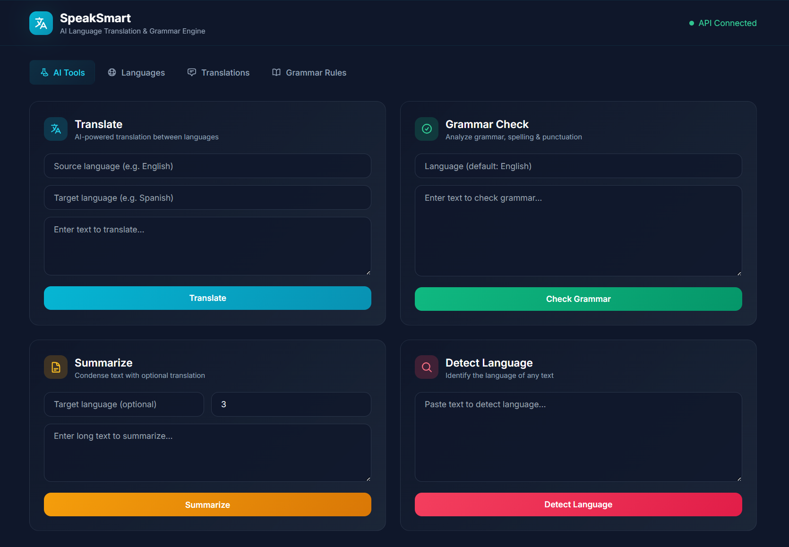

<p align="center">
  
  
  
</p>


# SpeakSmart
## AI Language Translation & Grammar Engine

SpeakSmart is a powerful RESTful API for language translation, grammar checking, and text analysis, powered by **Google Gemini AI** and **Flask**. It enables seamless multilingual communication, advanced grammar correction, and text summarization for developers and businesses.

## Screenshots




## 📋 Table of Contents

- [Features](#features)
- [Tech Stack](#tech-stack)
- [Project Structure](#project-structure)
- [Setup & Installation](#setup--installation)
- [Configuration](#configuration)
- [Running the Server](#running-the-server)
- [API Endpoints](#api-endpoints)
  - [Languages (CRUD)](#languages-crud)
  - [Translations (CRUD)](#translations-crud)
  - [Grammar Rules (CRUD)](#grammar-rules-crud)
  - [AI Endpoints](#ai-endpoints)
- [Usage Examples](#usage-examples)
- [Testing](#testing)
- [Error Handling](#error-handling)
- [GenAI Usage Summary](#genai-usage-summary)


## 🚀 Features

- **CRUD APIs** — Create, Read, Update, Delete for Languages, Translations, and Grammar Rules
- **Multi-table SQLite database** — 4 tables with foreign key relationships
- **AI-powered endpoints** — Translation, grammar checking, summarization, and language detection via Google Gemini
- **Prompt engineering** — Structured prompts returning JSON for reliable parsing
- **Error handling & logging** — Global error handlers, file + console logging
- **Translation history** — Automatic audit trail of AI translation operations


## 🛠️ Tech Stack

| Component     | Technology                  |
|-------------- |----------------------------|
| Language      | Python 3.10+               |
| Framework     | Flask                      |
| Database      | SQLite                     |
| AI Provider   | Google Gemini (gemini-2.0-flash) |
| Testing       | pytest / unittest           |
| API Testing   | Postman / curl              |


## 📁 Project Structure


```
SpeakSmart/
├── app/
│   ├── __init__.py            # Flask app factory
│   ├── config.py              # Configuration
│   ├── models/
│   │   ├── database.py        # DB init & connection
│   │   ├── language.py        # Language model
│   │   ├── translation.py     # Translation model
│   │   ├── grammar_rule.py    # Grammar rule model
│   │   └── history.py         # Translation history model
│   ├── routes/
│   │   ├── languages.py       # /api/languages CRUD
│   │   ├── translations.py    # /api/translations CRUD
│   │   ├── grammar_rules.py   # /api/grammar-rules CRUD
│   │   └── ai.py              # /api/ai/* AI endpoints
│   ├── services/
│   │   └── ai_service.py      # Gemini integration
│   └── utils/
│       ├── errors.py          # Error handlers
│       └── logger.py          # Logging config
├── tests/
│   └── test_api.py            # Automated tests
├── logs/                      # Generated at runtime
├── requirements.txt
├── run.py                     # Entry point
├── .env.example
└── README.md
```


## ⚡ Setup & Installation


1. **Clone / Navigate to the project**
  ```bash
  cd SpeakSmart
  ```

2. **Create a virtual environment**
  ```bash
  python -m venv venv
  # Windows
  venv\Scripts\activate
  # macOS/Linux
  source venv/bin/activate
  ```

3. **Install dependencies**
  ```bash
  pip install -r requirements.txt
  ```

4. **Configure environment**
  ```bash
  copy .env.example .env
  # Edit .env and add your GEMINI_API_KEY
  ```
  Get a free API key from [Google AI Studio](https://aistudio.google.com/apikey).


## ⚙️ Configuration

| Variable | Default | Description |
|---|---|---|
| `GEMINI_API_KEY` | *(required)* | Google Gemini API key |
| `FLASK_DEBUG` | `True` | Enable debug mode |
| `FLASK_PORT` | `5000` | Server port |


## ▶️ Running the Server

```bash
python run.py
```

The server starts at `http://localhost:5000`. The SQLite database (`speaksmart.db`) is auto-created on first run.


## 🌐 API Endpoints


### Health Check
```http
GET /api/health
```


### Languages (CRUD)
| Method | Endpoint                | Body                                  |
|--------|-------------------------|---------------------------------------|
| GET    | `/api/languages`        | —                                     |
| GET    | `/api/languages/<id>`   | —                                     |
| POST   | `/api/languages`        | `{ "name": "English", "code": "en" }` |
| PUT    | `/api/languages/<id>`   | `{ "name": "...", "code": "..." }`     |
| DELETE | `/api/languages/<id>`   | —                                     |


### Translations (CRUD)
| Method | Endpoint                    | Body                                                                 |
|--------|-----------------------------|---------------------------------------------------------------------|
| GET    | `/api/translations`         | —                                                                   |
| GET    | `/api/translations/<id>`    | —                                                                   |
| POST   | `/api/translations`         | `{ "source_language_id": 1, "target_language_id": 2, "source_text": "Hello", "translated_text": "Hola" }` |
| PUT    | `/api/translations/<id>`    | `{ "translated_text": "..." }`                                    |
| DELETE | `/api/translations/<id>`    | —                                                                   |


### Grammar Rules (CRUD)
| Method | Endpoint                      | Body                                                                                                   |
|--------|-------------------------------|-------------------------------------------------------------------------------------------------------|
| GET    | `/api/grammar-rules`          | —                                                                                                     |
| GET    | `/api/grammar-rules/<id>`     | —                                                                                                     |
| POST   | `/api/grammar-rules`          | `{ "language_id": 1, "rule_name": "Subject-Verb Agreement", "description": "...", "example_correct": "...", "example_incorrect": "..." }` |
| PUT    | `/api/grammar-rules/<id>`     | `{ "description": "..." }`                                                                          |
| DELETE | `/api/grammar-rules/<id>`     | —                                                                                                     |


### AI Endpoints

#### Translate
```http
POST /api/ai/translate
{
  "text": "Hello, how are you?",
  "source_language": "English",
  "target_language": "Spanish"
}
```

#### Grammar Check
```http
POST /api/ai/grammar-check
{
  "text": "He dont goes to school everyday.",
  "language": "English"
}
```

#### Summarize
```http
POST /api/ai/summarize
{
  "text": "Long text to summarize...",
  "target_language": "French",
  "max_sentences": 3
}
```

#### Language Detection
```http
POST /api/ai/language-detect
{
  "text": "Bonjour le monde"
}
```

#### Translation History
```http
GET /api/ai/history?limit=50
```


## 🧪 Testing

Run all automated tests:
```bash
python -m pytest tests/test_api.py -v
```


## 🛡️ Error Handling

All errors return consistent JSON:
```json
{
  "error": "Not found",
  "message": "Language with id 99 not found"
}
```
Standard HTTP status codes: `200`, `201`, `400`, `404`, `500`.


## 🤖 GenAI Usage Summary

| Feature           | How AI Is Used                                                                 |
|-------------------|-------------------------------------------------------------------------------|
| Translation       | Gemini translates text between any language pair with confidence scoring       |
| Grammar Check     | Gemini analyzes grammar, spelling, punctuation; returns corrections with scores|
| Summarization     | Gemini condenses text with optional target-language output                     |
| Language Detection| Gemini identifies the language of input text with alternatives                 |

All prompts are engineered to return structured JSON responses with graceful fallback parsing.


## 📖 Usage Examples

### Translate English to Spanish
```bash
curl -X POST http://localhost:5000/api/ai/translate \
  -H "Content-Type: application/json" \
  -d '{"text": "Hello, how are you?", "source_language": "English", "target_language": "Spanish"}'
```

### Grammar Check
```bash
curl -X POST http://localhost:5000/api/ai/grammar-check \
  -H "Content-Type: application/json" \
  -d '{"text": "He dont goes to school everyday.", "language": "English"}'
```

### Summarize Text
```bash
curl -X POST http://localhost:5000/api/ai/summarize \
  -H "Content-Type: application/json" \
  -d '{"text": "Long text to summarize...", "target_language": "French", "max_sentences": 3}'
```


## 📬 Contact & Support

For questions, feature requests, or bug reports, please open an issue or contact the maintainer.


<p align="center">Made with ❤️ by Abhinav Kumar</p>
